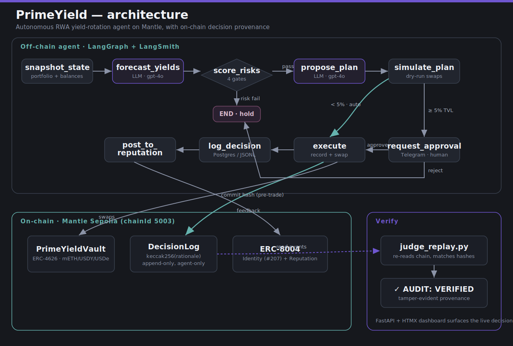

<div align="center">

# PrimeYield

### Autonomous RWA yield-rotation agent on Mantle — with a full on-chain audit trail.

*Agent speed. Smart-contract verifiability.*

[](https://sepolia.mantlescan.xyz/address/0x9793b46d8a19B7B5cD6d397901cF2EE2fd1761c2)
[](https://sepolia.mantlescan.xyz/tx/0x662e1ba0be45601081e23fd52f2f53c03aec11ae564f6fe36b52840465a47160)
[](docs/AUDIT.md)
[](LICENSE)

Built for the **Mantle Turing Test Hackathon 2026** · AI × RWA track

</div>

---

PrimeYield rotates capital across **mETH** (Mantle LSP), **USDY** (Ondo Treasuries),
and **USDe** — and commits a cryptographic hash of its reasoning **on-chain before
every trade**. A 9-node LangGraph agent decides; a Monte Carlo risk engine gates;
a human approves large moves over Telegram; and anyone can replay the chain to
prove exactly what the agent decided and that no one edited it afterward.

> **Why it matters.** Manual RWA yield rotation is slow and loses alpha. Black-box
> agents could fix that — but they're uninsurable, because nobody can verify their
> decisions. PrimeYield is autonomous **and** auditable.

## ✦ Live on Mantle Sepolia (chainId 5003)

| Artifact | Address / proof |
|----------|-----------------|
| ERC-8004 agent | **#207** · [register tx](https://sepolia.mantlescan.xyz/tx/0x662e1ba0be45601081e23fd52f2f53c03aec11ae564f6fe36b52840465a47160) |
| Vault (ERC-4626) | [`0x9793…61c2`](https://sepolia.mantlescan.xyz/address/0x9793b46d8a19B7B5cD6d397901cF2EE2fd1761c2) |
| DecisionLog | [`0xBb7A…7689`](https://sepolia.mantlescan.xyz/address/0xBb7A7f398f299E97BdeBFD12F357b70B2dcf7689) |
| Example AI decision on-chain | [`0x463b020f…`](https://sepolia.mantlescan.xyz/tx/0x463b020fdb6ebd1a57c5fa4635f8c18f555dcf2378d0718efe90335bee8ac5f0) (USDY→USDe, USDY→mETH) |
| Audit verdict | **VERIFIED — on-chain=3, matched=3, tamper=0** |

## How it works

<div align="center">
  
</div>

1. **Snapshot & forecast** — reads the portfolio; an LLM forecasts per-asset yield.
2. **Risk gates** — 10k-path Monte Carlo VaR/ES, oracle-deviation, slippage cap, concentration limit.
3. **Propose & simulate** — the agent proposes a rebalance and dry-runs it.
4. **Human-in-the-loop** — small moves auto-execute; large ones escalate via Telegram.
5. **Provenance** — `keccak256(rationale)` → `DecisionLog` **before** any funds move.
6. **Audit** — [`scripts/judge_replay.py`](scripts/judge_replay.py) re-reads the chain and matches every hash to its stored rationale. Tampering breaks the match.

## Stack

LangGraph + LangSmith · OpenAI `gpt-4o` (provider-agnostic — swap to Claude via `LLM_PROVIDER`) ·
Solidity / Foundry · ERC-4626 vault · ERC-8004 identity + reputation ·
FastAPI + HTMX dashboard · Pinata / IPFS agent card · python-telegram-bot.

## Quickstart

```bash
cp .env.example .env          # fill in keys (see comments in the file)
make install                  # uv sync + forge install (needs Foundry)
make test                     # forge test --evm-version paris && pytest

# Run the agent + verify it
uv run python scripts/run_cycle.py --auto      # one full decision cycle
uv run python scripts/judge_replay.py          # → VERIFIED audit (docs/AUDIT.md)
uv run uvicorn api.main:app --port 8000        # dashboard at /dashboard
```

## Repo map

- [`agent/`](agent) — LangGraph nodes, risk engine, adapters, LLM factory, persistence
- [`contracts/`](contracts) — `PrimeYieldVault` (ERC-4626) + `DecisionLog` (Foundry)
- [`scripts/`](scripts) — register, deploy, run a cycle, judge replay
- [`api/`](api) — FastAPI dashboard + Telegram approval webhook
- [`docs/`](docs) — [README](docs/README.md), [JUDGES](docs/JUDGES.md) rubric map, [AUDIT](docs/AUDIT.md)

## License

MIT
